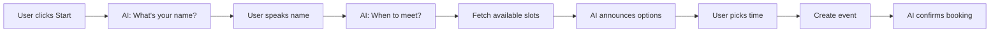

# 🎙️ Voice Assistant

A modern web application that uses voice AI to schedule meetings through natural conversation in Russian. Built with
Next.js, Vapi.ai for voice interaction, and Nylas Calendar API for meeting management.

[](https://nextjs.org/)
[](https://react.dev/)
[](https://www.typescriptlang.org/)
[](https://vapi.ai)
[](https://nylas.com)

---

## 📋 Table of Contents

- [Features](#-features)
- [Quick Start](#-quick-start)
- [How It Works](#-how-it-works)
- [Tech Stack](#-tech-stack)
- [Project Structure](#-project-structure)
- [Architecture](#-architecture)
- [API Documentation](#-api-documentation)
- [Development](#-development)
- [Deployment](#-deployment)
- [Contributing](#-contributing)

---

## ✨ Features

- 🗣️ **Natural Voice Interaction** - Speak naturally in Russian to book meetings
- 📅 **Smart Scheduling** - AI understands flexible time preferences
- 🔄 **Real-time Availability** - Fetches available slots from your calendar
- ⏰ **Time Rounding** - Automatically rounds to 5-minute intervals
- 🎨 **Modern UI** - Clean, responsive design with real-time status updates
- 🌐 **Multi-language Voice** - Russian speech recognition and text-to-speech
- 🔒 **Secure** - Server-side API keys, client-side voice processing

---

## 🚀 Quick Start

### Prerequisites

- Node.js 18+ and npm
- Vapi.ai account ([Sign up](https://vapi.ai))
- Nylas account ([Sign up](https://dashboard.nylas.com))
- Connected calendar (Google, Outlook, etc.)

### Installation

```bash
# Clone the repository
git clone https://github.com/virage81/voice-assistant.git
cd voice-assistant

# Install dependencies
npm install

# Copy environment template
cp .env.example .env.local

# Edit .env.local with your API keys
# See SETUP.md for detailed configuration guide

# Run development server
npm run dev
```

Open [http://localhost:3000](http://localhost:3000) and start talking!

📖 **For detailed setup instructions, see [SETUP.md](./SETUP.md)**

---

## 🎯 How It Works

### User Flow



### Conversation Example

```
🤖 AI: Привет! Как тебя зовут?
👤 User: Меня зовут Антон

🤖 AI: Когда тебе было бы удобно встретиться?
👤 User: В пятницу утром

🤖 AI: Доступны: Пятница 10:00, Пятница 11:00, Пятница 14:00. Когда тебе удобно?
👤 User: В 11 часов

🤖 AI: Готово, встреча забронирована на пятницу в 11:00. Спасибо, Антон!
```

---

## 🛠 Tech Stack

### Core Technologies

- **Framework**: [Next.js 15.5](https://nextjs.org/) with Turbopack
- **UI Library**: [React 19](https://react.dev/)
- **Language**: [TypeScript 5](https://www.typescriptlang.org/)
- **Styling**: [Tailwind CSS 4](https://tailwindcss.com/)

### Voice & AI

- **Voice AI**: [Vapi.ai Web SDK 2.4](https://vapi.ai) - Speech recognition & synthesis
- **LLM**: OpenAI GPT-4o-mini (via Vapi)
- **Transcription**: Deepgram Nova-2 (via Vapi)
- **TTS**: OpenAI Alloy voice (via Vapi)

### Calendar Integration

- **Calendar API**: [Nylas SDK 7.13](https://developer.nylas.com/)
- **Features**: Availability checking, event creation
- **Providers**: Google, Outlook, iCloud, and more

---

## 📁 Project Structure

```
voice-assistant/
├── src/
│   ├── app/                        # Next.js App Router
│   │   ├── api/                    # API Routes
│   │   │   ├── check-availability/ # GET - Check available slots
│   │   │   └── create-event/       # POST - Create meeting
│   │   ├── page.tsx               # Main UI component
│   │   ├── layout.tsx             # Root layout
│   │   └── globals.css            # Global styles
│   │
│   ├── hooks/                      # Custom React Hooks
│   │   └── useVapi.ts             # Vapi logic & state management
│   │
│   ├── lib/                        # Core Libraries
│   │   ├── vapi/                  # Vapi Integration
│   │   │   ├── index.ts           # Client singleton
│   │   │   └── assistant.ts       # AI configuration
│   │   ├── nylas/                 # Nylas Integration
│   │   │   ├── index.ts           # Client singleton
│   │   │   └── calendar.ts        # Calendar operations
│   │   └── utils/                 # Utilities
│   │       └── time.ts            # Time rounding functions
│   │
│   ├── types/                      # TypeScript Definitions
│   │   └── vapi.ts                # Vapi types
│   │
│   └── config/                     # Configuration
│       └── index.ts               # Environment config
│
├── public/                         # Static Assets
├── .env.example                    # Environment template
├── .env.local                      # Your local config (create this)
│
└── Documentation/
    ├── SETUP.md                    # Setup guide
    ├── ARCHITECTURE.md             # System architecture
    ├── API.md                      # API reference
    └── QUICK_FIX.md               # Quick fixes
```

---

## 🏗 Architecture

### Custom Hook: `useVapi`

Encapsulates all Vapi logic with clean interface:

```typescript
const { isCallActive, status, statusMessage, startCall, endCall } = useVapi();
```

**Status Flow:**

```
idle → starting → active → listening/processing
                     ↓
          checking-availability
                     ↓
            creating-event
                     ↓
            success / error / ended
```

### API Endpoints

#### `GET /api/check-availability`

Fetches available meeting slots for the next 7 days.

**Response:**

```json
{
	"slots": [{ "date": "2025-11-07T10:00:00.000Z" }, { "date": "2025-11-07T14:00:00.000Z" }]
}
```

#### `POST /api/create-event`

Creates a calendar event.

**Request:**

```json
{
	"name": "Anton",
	"dateTime": "2025-11-07T11:00:00Z"
}
```

**Response:**

```json
{
	"event": {
		"id": "event_123",
		"title": "Meeting with Anton",
		"when": { "time": 1730977200, "timezone": "Europe/Moscow" }
	}
}
```

### Time Utilities

All timestamps are rounded to 5-minute intervals:

```typescript
roundToNearestFiveMinutes(timestamp); // Milliseconds
roundToNearestFiveMinutesInSeconds(timestamp); // Seconds
roundDateToNearestFiveMinutes(date); // Date object
```

**Examples:**

- 10:03 → 10:05
- 14:42 → 14:45
- 16:58 → 17:00

📖 **For detailed architecture, see [ARCHITECTURE.md](./ARCHITECTURE.md)**

---

## 📚 API Documentation

See [API.md](./API.md) for complete API reference including:

- Endpoint specifications
- Request/response formats
- Error handling
- Integration examples

---

## 💻 Development

### Commands

```bash
# Development server with hot reload
npm run dev

# Production build
npm run build

# Start production server
npm start

# Run linter
npm run lint

# Type checking
npx tsc --noEmit
```

### Environment Variables

| Variable                   | Description         | Required | Example                    |
| -------------------------- | ------------------- | -------- | -------------------------- |
| `NEXT_PUBLIC_APP_URL`      | Application URL     | Yes      | `http://localhost:3000`    |
| `NEXT_PUBLIC_VAPI_API_KEY` | Vapi API key        | Yes      | `vapi_xxx...`              |
| `NYLAS_API_URL`            | Nylas API endpoint  | Yes      | `https://api.us.nylas.com` |
| `NYLAS_API_KEY`            | Nylas API key       | Yes      | `nyk_v0_xxx...`            |
| `NYLAS_GRANT_ID`           | Nylas grant ID      | Yes      | `grant_xxx...`             |
| `NYLAS_CALENDAR_ID`        | Calendar identifier | Yes      | `your@email.com`           |

### Git Workflow

This project follows [Gitflow](https://www.atlassian.com/git/tutorials/comparing-workflows/gitflow-workflow):

- `main` - Production-ready code
- `develop` - Integration branch
- `feature/*` - New features
- `release/*` - Release preparation
- `hotfix/*` - Production fixes

---

## 🚢 Deployment

### Vercel (Recommended)

```bash
# Install Vercel CLI
npm i -g vercel

# Deploy
vercel

# Set environment variables in Vercel dashboard
```

### Environment Setup for Production

1. Update `NEXT_PUBLIC_APP_URL` to your production domain
2. Ensure HTTPS (required for microphone access)
3. Set all environment variables in hosting platform
4. Test voice functionality in production

### Deployment Checklist

- [ ] All environment variables configured
- [ ] HTTPS enabled
- [ ] Microphone permissions tested
- [ ] Calendar integration verified
- [ ] Error monitoring setup (optional)
- [ ] CORS configured (if needed)

---

---

## 🤝 Contributing

### Development Principles

1. **Code in English** - All code, comments, and documentation
2. **UI in Russian** - User-facing text in Russian
3. **Type Safety** - Full TypeScript coverage
4. **Clean Code** - Follow established patterns
5. **Documentation** - Update docs with changes

### Adding Features

1. Create feature branch: `git checkout -b feature/your-feature`
2. Make changes with proper types
3. Update documentation
4. Test thoroughly
5. Submit pull request to `develop`

---

## 📄 License

This project is proprietary and confidential.

---

## 🙏 Acknowledgments

- [Vapi.ai](https://vapi.ai) - Voice AI platform
- [Nylas](https://nylas.com) - Calendar API
- [Next.js](https://nextjs.org) - React framework
- [OpenAI](https://openai.com) - LLM and TTS
- [Deepgram](https://deepgram.com) - Speech recognition

---

## 📞 Support

- **Documentation**: See documentation files in root
- **Setup Guide**: [SETUP.md](./SETUP.md)
- **Architecture**: [ARCHITECTURE.md](./ARCHITECTURE.md)
- **API Reference**: [API.md](./API.md)

---

Made with ❤️ by Updevision
